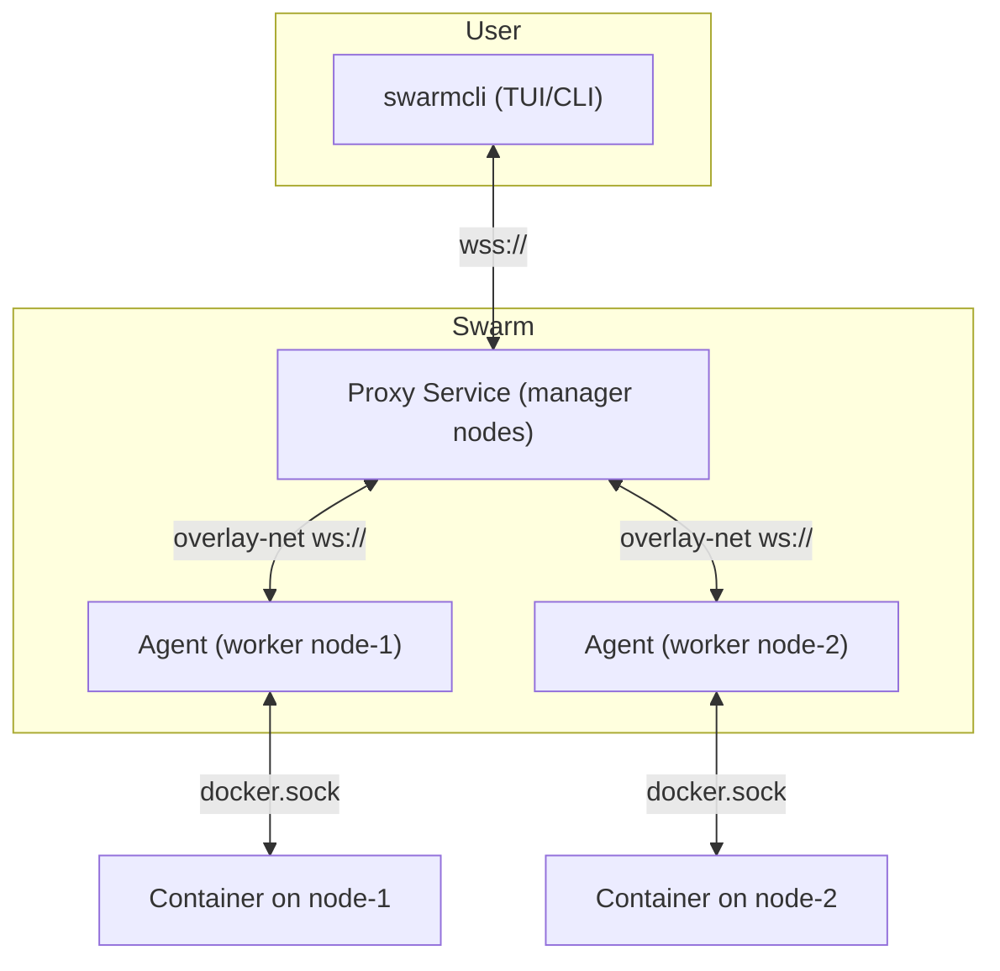

# Swarmcli Agent + Proxy

This repository contains two components for building a `k9s`-like client for Docker Swarm:

- **Agent**: runs on every node (global service). Talks to the local Docker socket and exposes `/v1/exec` over WebSocket.
- **Proxy**: runs on manager nodes. Accepts client connections, resolves which worker node is running a given task, and proxies exec sessions to the correct Agent.

## Architecture



## Build

```bash
make build
make push
```

## Deploy

```bash
docker stack deploy -c stack.yml swarmctl
```

## Test

```bash
wscat -c "wss://<manager-host>:8443/v1/exec?task_id=<TASK_ID>&cmd=/bin/sh&tty=1"
```

## CLI Client

Build and run the CLI:

```bash
go build -o swarmcli ./cmd/cli
./bin/cli -task <TASK_ID> -proxy wss://<manager-host>:8443 -cmd /bin/sh
```


## TLS/mTLS

To secure proxy ↔ agent communication with mutual TLS:

- Provide these secrets in Docker Swarm:
  - `agent_cert`, `agent_key`, `agent_ca`
  - `proxy_client_cert`, `proxy_client_key`

Agents will verify client certificates using `agent_ca`.  
Proxies must present valid client certificates signed by this CA.

Update stack secrets accordingly before deployment.


## End-to-End Demo

Follow these steps to test the full setup with TLS/mTLS:

### 1. Generate Certificates

```bash
./gen-certs.sh
```

This creates certs under `certs/` (CA, agent, proxy).

### 2. Create Swarm Secrets

```bash
./create-secrets.sh
```

This loads all required certs into Docker Swarm as secrets.

### 3. Build and Push Images

```bash
make all-build
```

### 4. Deploy the Stack

```bash
docker stack deploy -c stack.yml swarmctl
```

Test it:
```bash
curl -k  --cert certs/agent.crt   --key certs/agent.key   --cacert certs/ca.crt  https://localhost:8443/health
{"status":"ok"}
```

This deploys:
- `agent` on every node (global)
- `proxy` on manager nodes (published on 8443)
- optional `cli` service (disabled by default)

### 5. Exec into a Container

Find a running task ID:

```bash
docker ps   # or docker service ps <service>
```

Run exec via CLI:

```bash
make local-build
./bin/cli -task <TASK_ID> -proxy wss://<manager-host>:8443 -cmd /bin/sh
```
